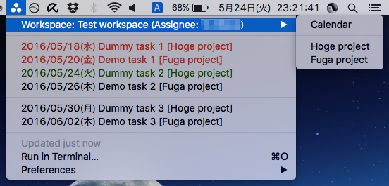
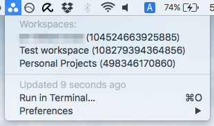
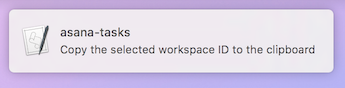

BitBar plugin for Asana
=======================

[BitBar](https://getbitbar.com/) plugin for Asana.
Displays the tasks that are assigned to you in the specified workspace.

 

Development Environment
-----------------------

* Mac OS X El Capitan 10.11.5
* BitBar v1.9.1
* Python v2.7.11

How to use
----------

### Install

1. Copy *asana-tasks.py* to BitBar plugin folder
1. Change filename include refresh time is in the filename
    * Detail see: [matryer/bitbar#configure-the-refresh-time](https://github.com/matryer/bitbar#configure-the-refresh-time)
1. Make sure it's executable (in Terminal, do chmod +x plugin.sh)

### Set your personal access token

1. How to obtain a token, please look at [Personal Access Tokens](https://asana.com/guide/help/api/api#gl-access-tokens).
1. Set personal access token to `PERSONAL_ACCESS_TOKEN` in *asana-tasks.py*

### Check workspace id

1. After set personal access token, then choose **Refresh all** from the BitBar menus
1. List of workspace id is displayed
    *  
1. When you select any of the workspace, workspace id is copied to the clipboard
    *  
1. Set personal access token to `WORKSPACE_ID` in *asana-tasks.py*

### Optional settings

*asana-tasks.py* has optional settings.

| Key | Value |
|---|---|
| `DISPLAY_RANGE_MONTH` | *(optional)* Range of the month to view the task   The default is `2` months |
| `LOCALE` | *(optional)* Language settings when you display date format   For example, `ja_JP` will use the date format of the Japanese locale |
| `MENUBAR_IMAGE` | *(optional)* Icon to be displayed in the menu bar (Base64 encoded image) |

### Use start

When all the settings are completed, then choose **Refresh all** from the BitBar menus
